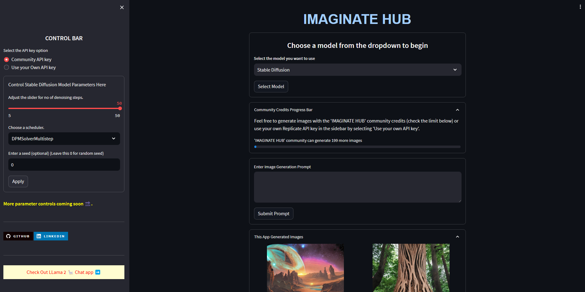

Got it! We'll build the frontend without react-router-dom and keep it simple (single-page app using conditional rendering).


---

1️⃣ Structure

frontend/
├── public/
│   └── index.html
├── src/
│   ├── components/
│   │   ├── Login.js
│   │   ├── Register.js
│   │   └── SecurePage.js
│   ├── App.js
│   ├── index.js
└── package.json

We’ll use Material-UI (MUI) for styling.


---

2️⃣ Install required dependencies

npm install @mui/material @emotion/react @emotion/styled axios


---

3️⃣ Code

index.js

import React from 'react';
import ReactDOM from 'react-dom/client';
import App from './App';

const root = ReactDOM.createRoot(document.getElementById('root'));
root.render(<App />);


---

App.js

import React, { useState } from 'react';
import Login from './components/Login';
import Register from './components/Register';
import SecurePage from './components/SecurePage';

export default function App() {
  const [page, setPage] = useState('login');
  const [token, setToken] = useState(null);

  return (
    <>
      {page === 'login' && <Login setPage={setPage} setToken={setToken} />}
      {page === 'register' && <Register setPage={setPage} />}
      {page === 'secure' && <SecurePage token={token} setPage={setPage} />}
    </>
  );
}


---

components/Login.js

import React, { useState } from 'react';
import { Button, TextField, Card, CardContent, Typography } from '@mui/material';
import axios from 'axios';

export default function Login({ setPage, setToken }) {
  const [username, setUsername] = useState('');
  const [password, setPassword] = useState('');

  const handleLogin = async () => {
    try {
      const res = await axios.post('http://localhost:5172/api/controller/login', { username, password });
      setToken(res.data.token);
      setPage('secure');
    } catch (err) {
      alert('Login failed');
    }
  };

  return (
    <Card style={{ width: 400, margin: '100px auto', padding: 20 }}>
      <CardContent>
        <Typography variant="h5" align="center">Login</Typography>
        <TextField fullWidth label="Username" margin="normal" onChange={e => setUsername(e.target.value)} />
        <TextField fullWidth type="password" label="Password" margin="normal" onChange={e => setPassword(e.target.value)} />
        <Button fullWidth variant="contained" color="primary" onClick={handleLogin}>Login</Button>
        <Button fullWidth style={{ marginTop: 10 }} onClick={() => setPage('register')}>Go to Register</Button>
      </CardContent>
    </Card>
  );
}


---

components/Register.js

import React, { useState } from 'react';
import { Button, TextField, Card, CardContent, Typography } from '@mui/material';
import axios from 'axios';

export default function Register({ setPage }) {
  const [username, setUsername] = useState('');
  const [password, setPassword] = useState('');

  const handleRegister = async () => {
    try {
      await axios.post('http://localhost:5172/api/controller/register', { username, password });
      alert('Registered successfully!');
      setPage('login');
    } catch (err) {
      alert('Registration failed');
    }
  };

  return (
    <Card style={{ width: 400, margin: '100px auto', padding: 20 }}>
      <CardContent>
        <Typography variant="h5" align="center">Register</Typography>
        <TextField fullWidth label="Username" margin="normal" onChange={e => setUsername(e.target.value)} />
        <TextField fullWidth type="password" label="Password" margin="normal" onChange={e => setPassword(e.target.value)} />
        <Button fullWidth variant="contained" color="primary" onClick={handleRegister}>Register</Button>
        <Button fullWidth style={{ marginTop: 10 }} onClick={() => setPage('login')}>Back to Login</Button>
      </CardContent>
    </Card>
  );
}


---

components/SecurePage.js

import React, { useEffect, useState } from 'react';
import { Button, Typography, Card, CardContent } from '@mui/material';
import axios from 'axios';

export default function SecurePage({ token, setPage }) {
  const [message, setMessage] = useState('');

  useEffect(() => {
    axios.get('http://localhost:5172/api/controller/secure', {
      headers: { Authorization: `Bearer ${token}` }
    })
    .then(res => setMessage(res.data))
    .catch(() => setMessage('Unauthorized'));
  }, [token]);

  return (
    <Card style={{ width: 400, margin: '100px auto', padding: 20 }}>
      <CardContent>
        <Typography variant="h6">Secure Data</Typography>
        <Typography>{message}</Typography>
        <Button fullWidth style={{ marginTop: 10 }} onClick={() => setPage('login')}>Logout</Button>
      </CardContent>
    </Card>
  );
}


---

4️⃣ Run the frontend

npm start


---

👉 This is fully working without react-router-dom (simple state-based page switching).


---

⚡ Do you want me to add JWT storage (localStorage) and show username after login?
Or should I combine frontend + backend in one zip (ready-to-run)?


# IMAGINATE HUB

Welcome to Imaginate Hub, a state-of-the-art image generation platform where imagination meets machine learning. Utilizing advanced models, this app offers a seamless experience for users to input prompts and visualize the resulting images.

🚀 **Explore Live Application**: Dive into the Imaginate Hub experience right now! Check out the [Live Model Here](https://image-generator-app.streamlit.app/).

 

## Features

- **User-friendly Interface**: An intuitive, clean UI allowing you to focus on creativity.
  
- **Model Variety**: Choose from several image generation models: "Stable Diffusion", "Anything-v4.0", "Waifu Diffusion", and "Vintedios Diffusion".
  
- **Rapid Image Generation**: Simply type in your desired prompt and watch the magic happen.

## Detailed Steps for Usage

1. **Launch the App**: Navigate to the application URL or start the Streamlit app.

2. **Sample Preview**: For insights on what to expect, click on the **"Prompt & Result Sample"** section to view a sample prompt and the resultant image.

3. **Model Selection**:
    - Navigate to the dropdown menu.
    - Select your desired image generation model.

4. **API Key Configuration**:
    - Locate the sidebar on the left.
    - Input your Replicate API key into the provided field. If you don't have one, you can obtain it by [following this guide](https://gist.github.com/MonishSoundarRaj/76d1d6ef9a806d879ef4357ae5111f00).

5. **Input Your Prompt**:
    - In the main section, locate the text area labeled "Enter Image Generation Prompt".
    - Type in your creative prompt.

6. **Generate Image**:
    - Click the "Submit Prompt" button.
    - Give the system a moment to process.
    - Once completed, the generated image will display on screen.

7. **Download the Result**:
    - Below the generated image, there will be an option to download it for personal use.

## Requirements

- Streamlit
- Replicate
- os module
- requests

## Installation

To set up and run Imaginate Hub on your own system:

1. Clone this repository:
```
git clone https://github.com/MonishSoundarRaj/image-generator-streamlit
```

2. Navigate to the project directory:
```
cd iamge-generator-streamlit
```

3. Install the required Python packages:
```
pip install -r requirements.txt
```

4. Run the Streamlit app:
```
streamlit run app.py
```

## License

This project falls under the MIT License. For more details, please check the [LICENSE](LICENSE) file.

